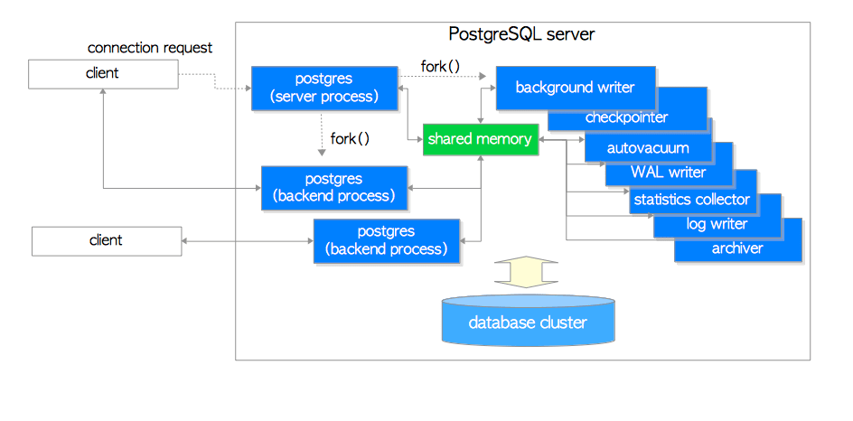

# postgresql 简介

## 1.发展历程


起源于加州大学伯克利分校（UCB）的数据库研究计划，PostgreSQL由UCB计算机科学教授Michael Stonebraker于1986年创建。

在1994年，两名伯克利的研究生在做研究生课题的时候， 向 Postgres 里增加了现代的 SQL 语言的支持（ SQL 作为语言，一直到1992年 才形成真正的国际标准（还是草案），当时称为 SQL2，但是人们常称为 SQL92）

1996年，重新命名为PostgreSQL，以反映数据库的新查询语言SQL，来自世界各地的数据库开发者和志愿者通过互联网协作起来，发行了PostgreSQL的第一个版本6.0，并且一直维护着这套软件。

#### **版本迭代**

从最初的版本PG95到现在，基本上它每年会发一个大的版本，每三个月左右可能会出一个小版本。我们今天所看到的已经release出来的最新版本是9.6的版本。


## 2. 安装

二进制下载安装

https://www.postgresql.org/download/


源码安装

https://www.postgresql.org/ftp/source/

https://github.com/postgres/postgres/releases


```
yum install -y readline readline-devel openssl openssl-devel zlib zlib-devel python-devel

./configure --prefix=/home/postgres/pg11 --with-python
make -j 12
make install

cd contrib
make -j 12
make install
```

PG参数参考： [blog/201812/20181203_01.md](https://github.com/digoal/blog/blob/bc01b3ab8a8e842e6eb98c3497710799eb2cf038/201812/20181203_01.md)
linux系统参数参考： [blog/201611/20161121_01.md](https://github.com/digoal/blog/blob/bc01b3ab8a8e842e6eb98c3497710799eb2cf038/201611/20161121_01.md)

```
# vi /etc/sysctl.conf

# add by digoal.zhou
fs.aio-max-nr = 1048576
fs.file-max = 76724600
kernel.core_pattern= /data01/corefiles/core_%e_%u_%t_%s.%p         
# /data01/corefiles事先建好，权限777，如果是软链接，对应的目录修改为777
kernel.sem = 4096 2147483647 2147483646 512000    
# 信号量, ipcs -l 或 -u 查看，每16个进程一组，每组信号量需要17个信号量。
kernel.shmall = 107374182      
# 所有共享内存段相加大小限制(建议内存的80%)
kernel.shmmax = 274877906944   
# 最大单个共享内存段大小(建议为内存一半), >9.2的版本已大幅降低共享内存的使用
kernel.shmmni = 819200         
# 一共能生成多少共享内存段，每个PG数据库集群至少2个共享内存段
net.core.netdev_max_backlog = 10000
net.core.rmem_default = 262144       
# The default setting of the socket receive buffer in bytes.
net.core.rmem_max = 4194304          
# The maximum receive socket buffer size in bytes
net.core.wmem_default = 262144       
# The default setting (in bytes) of the socket send buffer.
net.core.wmem_max = 4194304          
# The maximum send socket buffer size in bytes.
net.core.somaxconn = 4096
net.ipv4.tcp_max_syn_backlog = 4096
net.ipv4.tcp_keepalive_intvl = 20
net.ipv4.tcp_keepalive_probes = 3
net.ipv4.tcp_keepalive_time = 60
net.ipv4.tcp_mem = 8388608 12582912 16777216
net.ipv4.tcp_fin_timeout = 5
net.ipv4.tcp_synack_retries = 2
net.ipv4.tcp_syncookies = 1    
# 开启SYN Cookies。当出现SYN等待队列溢出时，启用cookie来处理，可防范少量的SYN攻击
net.ipv4.tcp_timestamps = 1    
# 减少time_wait
net.ipv4.tcp_tw_recycle = 0    
# 如果=1则开启TCP连接中TIME-WAIT套接字的快速回收，但是NAT环境可能导致连接失败，建议服务端关闭它
net.ipv4.tcp_tw_reuse = 1      
# 开启重用。允许将TIME-WAIT套接字重新用于新的TCP连接
net.ipv4.tcp_max_tw_buckets = 262144
net.ipv4.tcp_rmem = 8192 87380 16777216
net.ipv4.tcp_wmem = 8192 65536 16777216
net.nf_conntrack_max = 1200000
net.netfilter.nf_conntrack_max = 1200000
vm.dirty_background_bytes = 409600000       
#  系统脏页到达这个值，系统后台刷脏页调度进程 pdflush（或其他） 自动将(dirty_expire_centisecs/100）秒前的脏页刷到磁盘
vm.dirty_expire_centisecs = 3000             
#  比这个值老的脏页，将被刷到磁盘。3000表示30秒。
vm.dirty_ratio = 95                          
#  如果系统进程刷脏页太慢，使得系统脏页超过内存 95 % 时，则用户进程如果有写磁盘的操作（如fsync, fdatasync等调用），则需要主动把系统脏页刷出。
#  有效防止用户进程刷脏页，在单机多实例，并且使用CGROUP限制单实例IOPS的情况下非常有效。  
vm.dirty_writeback_centisecs = 100            
#  pdflush（或其他）后台刷脏页进程的唤醒间隔， 100表示1秒。
vm.mmap_min_addr = 65536
vm.overcommit_memory = 0     
#  在分配内存时，允许少量over malloc, 如果设置为 1, 则认为总是有足够的内存，内存较少的测试环境可以使用 1 .  
vm.overcommit_ratio = 90     
#  当overcommit_memory = 2 时，用于参与计算允许指派的内存大小。
vm.swappiness = 0            
#  关闭交换分区
vm.zone_reclaim_mode = 0     
# 禁用 numa, 或者在vmlinux中禁止. 
net.ipv4.ip_local_port_range = 40000 65535    
# 本地自动分配的TCP, UDP端口号范围
fs.nr_open=20480000
# 单个进程允许打开的文件句柄上限
net.ipv4.tcp_max_syn_backlog = 16384
net.core.somaxconn = 16384

# 以下参数请注意
# vm.extra_free_kbytes = 4096000
# vm.min_free_kbytes = 2097152 # vm.min_free_kbytes 建议每32G内存分配1G vm.min_free_kbytes
# 如果是小内存机器，以上两个值不建议设置
# vm.nr_hugepages = 66536    
#  建议shared buffer设置超过64GB时 使用大页，页大小 /proc/meminfo Hugepagesize
# vm.lowmem_reserve_ratio = 1 1 1
# 对于内存大于64G时，建议设置，否则建议默认值 256 256 32
```

#### 初始化

```
initdb -D $PGDATA -E UTF8 
```

#### 修改配置

```
vi postgres.conf
vi pg_hba.conf
```

#### 启动

```
pg_ctl start
```


## 3. 结构

### pg 软件目录结构

```
├── bin
│   ├── clusterdb
│   ├── createdb
│   ├── createuser
│   ├── dropdb
│   ├── dropuser
│   ├── ecpg
│   ├── initdb
│   ├── oid2name
│   ├── pg_archivecleanup
│   ├── pg_basebackup
│   ├── pgbench
│   ├── pg_config
│   ├── pg_controldata
│   ├── pg_ctl
│   ├── pg_dump
│   ├── pg_dumpall
│   ├── pg_isready
│   ├── pg_receivewal
│   ├── pg_recvlogical
│   ├── pg_resetwal
│   ├── pg_restore
│   ├── pg_rewind
│   ├── pg_standby
│   ├── pg_test_fsync
│   ├── pg_test_timing
│   ├── pg_upgrade
│   ├── pg_verify_checksums
│   ├── pg_waldump
│   ├── postgres
│   ├── postmaster -> postgres
│   ├── psql
│   ├── reindexdb
│   ├── vacuumdb
│   └── vacuumlo
├── include
│   ├── informix
│   ├── internal
│   ├── libpq
│   └── server
├── lib
│   ├── pgxs
│   └── pkgconfig
└── share
    ├── doc
    ├── extension
    ├── timezone
    ├── timezonesets
    └── tsearch_data
```


### Database cluster结构


**运行时架构**



## 4. 使用

### 基础用法

**client工具**

​     psql
​     pgAdmin4
​     DbVisualizer

**用户Roles管理**

```sql
--psql 登录
CREATE ROLE user_a LOGIN PASSWORD 'demo' VALID UNTIL 'infinity' CREATEDB;
CREATE ROLE user_b LOGIN PASSWORD 'demo' VALID UNTIL '2020-1-1 00:00' SUPERUSER;
--group role
CREATE ROLE group_r INHERIT;
\h create role
-- 一些属性 LOGIN CREATEDB SUPERUSER  INHERIT  CONNECTION

grant group_r to user_a;
\h grant

--切换用户权限
SET ROLE group_r;

--查看当前用户
SELECT session_user, current_user;

--直接用命令工具创建
createuser

--创建只读查询权限
GRANT SELECT on ALL TABLES IN SCHEMA schema_name to role_name;
```

**创建数据库**

```sql
CREATE DATABASE dbdemo
\c dbdemo;
CREATE SCHEMA s1;
CREATE SCHEMA s2;
create table s1.t1( id int );
create table s2.t2( id int );
select * from t1;
ALTER DATABASE dbdemo SET search_path="$user",public, s1;   --需要重新登陆才生效
select * from t1;
show SEARCH_PATH;
--查看schema
\dn
\dn+
\dnS+

\h create database

CREATE DATABASE name
    [ [ WITH ] [ OWNER [=] user_name ]
           [ TEMPLATE [=] template ]
           [ ENCODING [=] encoding ]
           [ LC_COLLATE [=] lc_collate ]
           [ LC_CTYPE [=] lc_ctype ]
           [ TABLESPACE [=] tablespace_name ]
           [ ALLOW_CONNECTIONS [=] allowconn ]
           [ CONNECTION LIMIT [=] connlimit ]
           [ IS_TEMPLATE [=] istemplate ] ]
```

 **其他表、视图、索引**

```

```


### 统计分析

```sql
--查看connections
SELECT pid, backend_type, query_start, state_change, state, query   
FROM pg_stat_activity; 

--kill client连接，除自身的连接
SELECT pg_terminate_backend(pid) 
       FROM  pg_stat_activity 
       WHERE pid <> pg_backend_pid() 
             AND backend_type = 'client backend';
```

```sql
--数据库
select * from pg_database;
\l
\l+

--用户表
select * from pg_stat_user_tables;
\d
\d+

--(TOAST) tables. 
--在PG中，页是数据在文件存储中的基本单位默认的大小为8KB。
--同时，PG不允许一行数据跨页存储，那么对于超长的行数据，PG就会启动TOAST，
select * from pg_statio_user_tables;

--index
select * from pg_stat_user_indexes
\di
\di+

--background worker
select * from pg_stat_bgwriter ;

pg_stat_activity             pg_stat_bgwriter             pg_stat_replication          pg_stat_sys_tables           pg_stat_wal_receiver         pg_stat_xact_user_tables
pg_stat_all_indexes          pg_stat_database             pg_stat_ssl                  pg_stat_user_functions       pg_stat_xact_all_tables
pg_stat_all_tables           pg_stat_database_conflicts   pg_stat_subscription         pg_stat_user_indexes         pg_stat_xact_sys_tables
pg_stat_archiver             pg_stat_progress_vacuum      pg_stat_sys_indexes          pg_stat_user_tables          pg_stat_xact_user_functions
```

#### sql语句统计

```sql
vi  postgresql.conf
shared_preload_libraries = 'pg_stat_statements'
pg_stat_statements.max = 10000
pg_stat_statements.track = all

--在想监控的数据库中执行
CREATE EXTENSION pg_stat_statements;

--重置统计信息
select pg_stat_reset();
select pg_stat_statements_reset();


--数据库耗时
select datname,sum(total_time) from pg_stat_statements t1, pg_database t2 where t1.dbid=t2.oid group by 1 order by 2 desc;

--单次调用最耗IO SQL TOP 5
select userid::regrole, dbid, query from pg_stat_statements order by (blk_read_time+blk_write_time)/calls desc limit 5;    

--总最耗IO SQL TOP 5
select userid::regrole, dbid, query from pg_stat_statements order by (blk_read_time+blk_write_time) desc limit 5;    

--单次调用最耗时 SQL TOP 5
select userid::regrole, dbid, query from pg_stat_statements order by mean_time desc limit 5;    

--总最耗时 SQL TOP 5
select userid::regrole, dbid, query from pg_stat_statements order by total_time desc limit 5;    

--响应时间抖动最严重 SQL
select userid::regrole, dbid, query from pg_stat_statements order by stddev_time desc limit 5;    
--最耗共享内存 SQL
select userid::regrole, dbid, query from pg_stat_statements order by (shared_blks_hit+shared_blks_dirtied) desc limit 5;    
--最耗临时空间 SQL
select userid::regrole, dbid, query from pg_stat_statements order by temp_blks_written desc limit 5;    
	
```


## 5. 备份和恢复

### **备份**

pg_dump test > /tmp/dump.sql 

```
Connection options:
  -d, --dbname=DBNAME      database to dump
  -h, --host=HOSTNAME      database server host or socket directory
  -p, --port=PORT          database server port number
  -U, --username=NAME      connect as specified database user
  -w, --no-password        never prompt for password
  -W, --password           force password prompt (should happen automatically)
  --role=ROLENAME          do SET ROLE before dump
```

**或配置环境变量**

PGHOST: It tells the system which host to connect to
PGPORT: It defines the TCP port to be used
PGUSER: It tells a client program about the desired user
PGPASSWORD: It contains the password to be used
PGDATABASE: It is the name of the database to connect to

**使用.pgpass**
格式: hostname:port:database:username:password  
chmod 0600 ~/.pgpass 

**使用.pg_service.conf**

[serv1_service] 
host=localhost 
port=5432 
dbname=test 
user=hs 
password=abc 

[serv2_service] 
host=192.168.0.45 
port=5432 
dbname=xyz 
user=aaaaa
password=cde 

**export serv1_service**

psql service=serv1_service


**导出文件类型**

```
-F, --format=c|d|t|p  output file  format (custom, directory, tar, plain  text  (default)) 
```

pg_dump -Fc test -f /tmp/dump.txt

**inspect the backup file:**

pg_restore --list /tmp/dump.txt


**备份到目录，生成多个文件:**
pg_dump -Fd test -f /tmp/backup/

开4个并行备份任务

```
pg_dump -Fd test -f /tmp/backup/ -j 4


```

**Replaying backups**

```
psql your_db < your_file.sql

createdb new_db
pg_restore -d new_db -j 4  /tmp/dump.txt
```


主从复制配置见： [Postgresql HA配置](https://krait007.github.io/#/gpdb_pg/postgresql_ha?id=postgresql-ha配置)


## 6. 压力测试

#### pgbench

```
createdb pgbench

pgbench -i pgbench

pgbench -c 30 -T 20 -r pgbench > file.out  2>&1

```


TPC-C是针对OLTP的测试，TPC-H和TPC-DS则是针对OLAP的测试


#### TPC-C

```
TPC-C于1992年7月获得批准，是针对OLTP的基准测试。
```

#### **TPC-H**

```
TPC-H是一款面向商品零售业的决策支持系统测试基准，它定义了8张表，22个查询，遵循SQL92；TPC-H基准的数据库模式遵循第三范式。
```

#### TPC-DS

```
TPC-DS采用星型、雪花型等多维数据模式。它包含7张事实表，17张纬度表平均每张表含有18列。其工作负载包含99个SQL查询，覆盖SQL99和2003的核心部分以及OLAP。这个测试集包含对大数据集的统计、报表生成、联机查询、数据挖掘等复杂应用，测试用的数据和值是有倾斜的，与真实数据一致。
```


## 7.PG其他特性

### fdw

```sql
--文件
CREATE EXTENSION file_fdw;

create server server_file_fdw foreign data wrapper file_fdw;

CREATE foreign TABLE ft_oil ( 
  region      text, 
  country     text, 
  year int, 
  production  int, 
  consumption int 
) server server_file_fdw options(filename '/home/postgres/oil.csv');

select * from ft_oil;

--数据库外表
create extension postgres_fdw ;    
select * from pg_foreign_data_wrapper;
select * from pg_foreign_server ;
\des

CREATE SERVER foreign_server
FOREIGN DATA WRAPPER postgres_fdw
OPTIONS (host 'xxx.xx.xxx.xx', port '5432', dbname 'foreign_db');

CREATE USER MAPPING FOR local_user
        SERVER foreign_server
        OPTIONS (user 'foreign_user', password 'password');

CREATE FOREIGN TABLE foreign_table (
        id integer NOT NULL,
        data text
)
        SERVER foreign_server
        OPTIONS (schema_name 'some_schema', table_name 'some_table');

```


### extension

主要组成:

```
扩展SQL文件 ( extension_name.sql )
扩展控制文件 ( extension_name.control )
扩展库文件   ( extension_name.so )
```

安装和删除

```sql
--安装在指定数据库下
CREATE EXTENSION extension_name
ALTER EXTENSION extension name
DROP EXTENIONS extension_name
```

查询

```sql
\dx
--所有已安装的
select * from pg_available_extensions;
select * from pg_available_extensions where installed_version <> '';
```

**比较有名的**

**madlib   http://madlib.apache.org/**

/usr/local/madlib/bin/madpack install -p postgres -s madlib -c "postgres@localhost:5432/dbdemo"

```sql
--官方例子
DROP TABLE IF EXISTS patients, patients_logregr, patients_logregr_summary;
 
CREATE TABLE patients( id INTEGER NOT NULL,
                        second_attack INTEGER,
                        treatment INTEGER,
                        trait_anxiety INTEGER);
                          
INSERT INTO patients VALUES                                                     
(1,     1,      1,      70),
(3,     1,      1,      50),
(5,     1,      0,      40),
(7,     1,      0,      75),
(9,     1,      0,      70),
(11,    0,      1,      65),
(13,    0,      1,      45),
(15,    0,      1,      40),
(17,    0,      0,      55),
(19,    0,      0,      50),
(2,     1,      1,      80),
(4,     1,      0,      60),
(6,     1,      0,      65),
(8,     1,      0,      80),
(10,    1,      0,      60),
(12,    0,      1,      50),
(14,    0,      1,      35),
(16,    0,      1,      50),
(18,    0,      0,      45),
(20,    0,      0,      60);

--Call MADlib built-in function to train a classification model 
--using the training data table as input:

SELECT madlib.logregr_train(
    'patients',                                 -- source table
    'patients_logregr',                         -- output table
    'second_attack',                            -- labels
    'ARRAY[1, treatment, trait_anxiety]',       -- features
    NULL,                                       -- grouping columns
    20,                                         -- max number of iteration
    'irls'                                      -- optimizer
    );
    
 --View the model 
 \x on
 SELECT * from patients_logregr;
 
 -- Display prediction value along with the original value
  \x off
 SELECT unnest(array['intercept', 'treatment', 'trait_anxiety']) as attribute,
        unnest(coef) as coefficient,
        unnest(std_err) as standard_error,
        unnest(z_stats) as z_stat,
        unnest(p_values) as pvalue,
        unnest(odds_ratios) as odds_ratio
 FROM patients_logregr;
 
-- Predicting the probability of the dependent variable being TRUE.
-- Display prediction value along with the original value
SELECT p.id, madlib.logregr_predict_prob(coef, ARRAY[1, treatment, trait_anxiety])
FROM patients p, patients_logregr m
ORDER BY p.id;
```


**PostGIS** http://www.postgis.org/


### 高级sql

Using sliding windows

```sql
CREATE TABLE t_oil ( 
  region      text, 
  country     text, 
  year int, 
  production  int, 
  consumption int 
); 

COPY t_oil FROM PROGRAM 'curl https://www.cybertec-postgresql.com/secret/oil_ext.txt'
COPY t_oil FROM '/home/postgres/oil_ext.txt';

SELECT region, avg(production) FROM  t_oil GROUP BY region

--ROLLUP注入一条记录，计算所有的均值
SELECT region, avg(production) FROM t_oil GROUP BY ROLLUP (region); 

explain SELECT region, avg(production) FROM t_oil GROUP BY ROLLUP (region); 

SELECT region, country, avg(production) 
    FROM t_oil   
    WHERE  country IN ('USA', 'Canada', 'Iran', 'Oman') 
    GROUP BY ROLLUP (region, country)
    order by region; 
    
SELECT region, country, avg(production) 
  FROM t_oil   
  WHERE country IN ('USA', 'Canada', 'Iran', 'Oman') 
  GROUP BY CUBE (region, country);  
  

SELECT region, country, avg(production) 
   FROM  t_oil 
   WHERE country IN ('USA', 'Canada', 'Iran', 'Oman') 
   GROUP BY GROUPING SETS ( (), region, country);
   
SELECT region, 
  avg(production) AS all, 
  avg(production) FILTER (WHERE year  < 1990) AS old,  
  avg(production) FILTER (WHERE year  >= 1990) AS new  
FROM t_oil  GROUP BY ROLLUP (region);    
```


hypothetical aggregates： 只支持rank

```
SELECT region, rank(9000) 
  WITHIN GROUP (ORDER BY production DESC NULLS LAST) 
FROM t_oil
GROUP BY ROLLUP (1); 

```

```
SELECT country, year, production, 
   consumption, avg(production) OVER () 
 FROM t_oil 
 LIMIT 4; 
```


### logical replication

Logical replication uses a  **publish** and **subscribe** model


### Partitioning data

Improving parallelism  from 9.6


### transaction

   pg只能没有错误的情况下完成commit，相对mysql没有这么严谨。

```
begin;
select 1;
select  1/0;
commit;
#输出  ROLLBACK
```

比较大的事务，每个步骤执行完成后创建一个保存点，后续步骤执行失败时，可回滚到之前的保存点，而不必回滚整个事务。

```
begin;
select 1;
SAVEPOINT step1;
select  1/0;
ROLLBACK TO SAVEPOINT step1
SELECT 3; 
COMMIT; 
```

DDL也支持事务，很多商业数据都不支持

除了DROP DATABASE, CREATE TABLESPACE/DROP TABLESPACE等), 大部分 DDLs 在pg里支持事务

```sql
begin;
create table t_demo( name varchar(64) );
alter table t_demo alter column name type varchar(255);
\d t_demo;
rollback;
\d t_demo;
```


### VACUUM

早起手工VACUUM，现在由autovacuum自动执行

```
postgresql.conf

#autovacuum = on                        # Enable autovacuum subprocess?  'on'
                                        # requires track_counts to also be on.
#log_autovacuum_min_duration = -1       # -1 disables, 0 logs all actions and
                                        # their durations, > 0 logs only
                                        # actions running at least this number
                                        # of milliseconds.
#autovacuum_max_workers = 3             # max number of autovacuum subprocesses
                                        # (change requires restart)
#autovacuum_naptime = 1min              # time between autovacuum runs
#autovacuum_vacuum_threshold = 50       # min number of row updates before
                                        # vacuum
#autovacuum_analyze_threshold = 50      # min number of row updates before
                                        # analyze
#autovacuum_vacuum_scale_factor = 0.2   # fraction of table size before vacuum
#autovacuum_analyze_scale_factor = 0.1  # fraction of table size before analyze
#autovacuum_freeze_max_age = 200000000  # maximum XID age before forced vacuum
                                        # (change requires restart)
#autovacuum_multixact_freeze_max_age = 400000000        # maximum multixact age
                                        # before forced vacuum
                                        # (change requires restart)
#autovacuum_vacuum_cost_delay = 20ms    # default vacuum cost delay for
                                        # autovacuum, in milliseconds;
                                        # -1 means use vacuum_cost_delay
#autovacuum_vacuum_cost_limit = -1      # default vacuum cost limit for
                                        # autovacuum, -1 means use
                                        # vacuum_cost_limit

```

VACUUM工作演示

```
CREATE TABLE t_demo (id int) WITH (autovacuum_enabled = off); 
INSERT INTO t_demo 
   SELECT * FROM generate_series(1, 100000);

SELECT pg_size_pretty(pg_relation_size('t_demo'));
pg_size_pretty
----------------
 3544 kB
(1 row)

UPDATE t_demo SET id = id + 1;  

SELECT pg_size_pretty(pg_relation_size('t_demo') );
pg_size_pretty
----------------
 7080 kB
 
VACUUM t_demo;  
SELECT pg_size_pretty(pg_relation_size('t_demo') );
pg_size_pretty
----------------
 7080 kB

UPDATE t_demo SET id = id + 1;  
SELECT pg_size_pretty(pg_relation_size('t_demo') );
pg_size_pretty
----------------
 7080 kB

UPDATE t_demo SET id = id + 1;  
SELECT pg_size_pretty(pg_relation_size('t_demo') );
 pg_size_pretty
----------------
 10 MB

#ctid
SELECT ctid, * FROM t_test ORDER BY ctid DESC; 

DELETE FROM t_demo where id < 1000;   
VACUUM t_demo;  
SELECT pg_size_pretty(pg_relation_size('t_demo') );
 pg_size_pretty
----------------
 10 MB

DELETE FROM t_demo where id > 99000;   
VACUUM t_demo;  
SELECT pg_size_pretty(pg_relation_size('t_demo') );
pg_size_pretty
----------------
 10 MB

VACUUM FULL
SELECT pg_size_pretty(pg_relation_size('t_demo') );

```


### explain

```sql
CREATE TABLE t_test (id int, name text);
INSERT INTO t_test (id, name ) SELECT a, 'pg' 
   FROM generate_series(1, 2000000) a; 
INSERT INTO t_test (id, name ) SELECT a, 'gp' 
     FROM generate_series(2000000, 4000000) a; 

--简单查询
\timing 
SELECT * FROM t_test WHERE id = 432332; 
   id   | name
--------+------
 432332 | pg
(1 row)

Time: 175.180 ms
 
--explain
explain SELECT * FROM t_test WHERE id = 432332; 

SET max_parallel_workers_per_gather TO 0;
explain SELECT * FROM t_test WHERE id = 432332; 
                        QUERY PLAN
----------------------------------------------------------
 Seq Scan on t_test  (cost=0.00..67700.01 rows=1 width=7)
   Filter: (id = 432332)
(2 rows)

--67700如何得来?
SELECT pg_relation_size('t_test') / 8192.0; 
 ?column?
--------------------
 17700.000000000000
(1 row)

SHOW seq_page_cost;
SHOW cpu_tuple_cost;
SHOW cpu_operator_cost;
SELECT 17700*1 + 4000000*0.01 + 4000000*0.0025; 
 ?column?
------------
 67700.0000
 
--添加索引
CREATE INDEX idx_id ON t_test (id); 
SELECT * FROM t_test WHERE id = 432332; 
 id   | name
--------+------
 432332 | pg
(1 row)

Time: 2.227 ms

explain SELECT * FROM t_test WHERE id = 432332; 

--索引有代价，空间换效率
\di+ 
                         List of relations
 Schema |  Name  | Type  |  Owner   | Table  | Size  | Description
--------+--------+-------+----------+--------+-------+-------------
 public | idx_id | index | postgres | t_test | 86 MB |
 

explain SELECT min(id), max(id) FROM t_test; 
explain SELECT * FROM t_test WHERE id = 30 OR id = 50;
```


**PG集群和读写分离**

**PgBouncer** 

• 低资源消耗
 • 会话保持
 • 多个后端数据库 • 多种模式 

- Session Pooling 

- Transaction Pooling 

- Statement Pooling 

  

**Pgpool-II**

• 连接池模式 • 复制管理
 • 读写分离
 • 负载均衡 

  • 并行查询 


## 8.学习资料

德哥博客 

​    https://github.com/digoal/blog/

在线电子书： 

​     The Internals of PostgreSQL   http://www.interdb.jp/pg/index.html

官网：

​    https://www.postgresql.org/
​    https://www.postgresql.org/docs/


pg书:

​     OReilly.PostgreSQL.Up.and.Running.3rd.Edition

​     Packt.Mastering.PostgreSQL.10

​     Packt.PostgreSQL.High.Availability.Cookbook.2nd.Edition